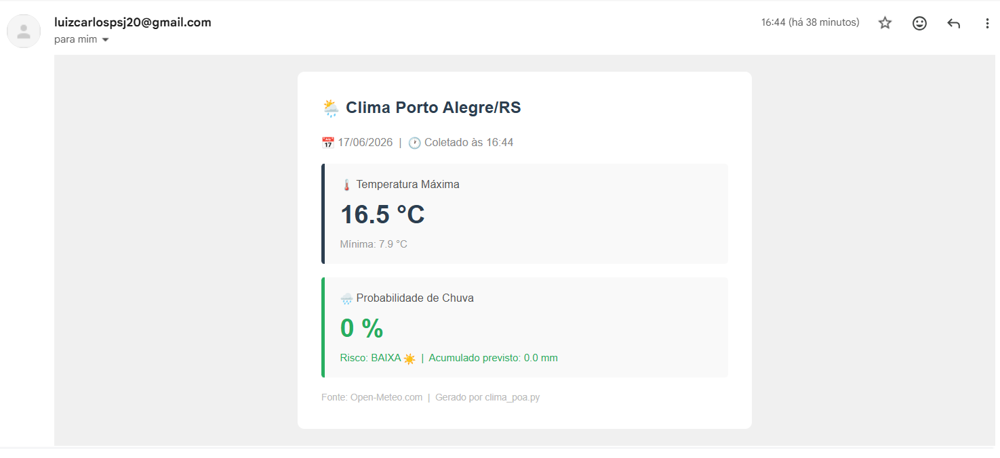

# Alerta Operacional Epavi — Clima POA

Busca temperatura máxima e probabilidade de chuva de Porto Alegre/RS e
envia um e-mail com o assunto **"Alerta Operacional Epavi - Clima POA"**.

---
## Como o código funciona

O script `clima_poa.py` é dividido em 3 etapas executadas em sequência:

### Etapa 1 — `buscar_clima()`: busca os dados na API

Faz uma requisição HTTP para a **Open-Meteo** (API gratuita, sem cadastro)
passando as coordenadas de Porto Alegre. A API devolve um JSON com a previsão
do dia, de onde o código extrai:

| Campo | O que é |
|---|---|
| `temperature_2m_max` | Temperatura máxima prevista para o dia (°C) |
| `temperature_2m_min` | Temperatura mínima prevista para o dia (°C) |
| `precipitation_probability_max` | Maior probabilidade de chuva do dia (%) |
| `precipitation_sum` | Total de chuva prevista acumulada (mm) |

> ⚠️ A API fornece **previsão** do dia, não temperatura em tempo real.
> Para ter a temperatura atual do momento, seria necessária outra API
> (ex: OpenWeatherMap, que exige cadastro gratuito).

### Etapa 2 — `montar_email()`: formata o conteúdo

Pega os dados da etapa anterior e monta o e-mail em dois formatos:
- **HTML** — versão visual com cards coloridos (vista na maioria dos clientes de e-mail)
- **Texto puro** — fallback para clientes que não renderizam HTML

A probabilidade de chuva é classificada automaticamente em:
- 🟢 **BAIXA** — abaixo de 40%
- 🟠 **MODERADA** — entre 40% e 70%
- 🔴 **ALTA** — acima de 70%

### Etapa 3 — `enviar_email()`: envia via SMTP

Conecta no servidor de e-mail (Gmail por padrão), faz login com as
credenciais configuradas e dispara a mensagem.

---

## Pré-requisitos

- Python 3.10 ou superior
- Biblioteca `requests` (`pip install requests`)

---

## Instalação

```bash
# 1. Baixe e entre na pasta
cd clima_poa

# 2. Instale a dependência
pip install requests
```

---

## Configuração

Abra `clima_poa.py` e edite as 3 linhas no topo:

```python
EMAIL_REMETENTE = "seuemail@gmail.com"
EMAIL_SENHA     = "xxxx xxxx xxxx xxxx"   # Senha de App (veja abaixo)
EMAIL_DESTINO   = "destinatario@email.com"
```

### Como gerar a Senha de App do Gmail

> A senha normal do Gmail **não funciona**. Você precisa de uma Senha de App.

1. Acesse: https://myaccount.google.com/apppasswords
2. Escolha **"Outro (nome personalizado)"** → digita "Epavi"
3. Clique em **Gerar** → copie os 16 caracteres
4. Cole no campo `EMAIL_SENHA` do script (sem espaços)

---

## Como rodar

### Passo 1 — Teste sem enviar e-mail

Rode isso primeiro para ver se tudo funciona antes de configurar o e-mail:

```bash
python clima_poa.py --teste
```

Saída esperada:

```
⚙️  MODO TESTE — usando dados fictícios (nenhum e-mail será enviado)

📅 Data         : 2025-06-17
🌡️  Temp. Máxima : 24.5 °C
🌡️  Temp. Mínima : 14.2 °C
🌧️  Prob. Chuva  : 80 %
💧 Acumulado    : 12.4 mm

==================================================
PRÉVIA DO E-MAIL (texto puro):
==================================================
Alerta Operacional Epavi - Clima POA
Porto Alegre/RS — 17/06/2025 — coletado às 07:00
...
==================================================
✅ Teste concluído. Nenhum e-mail foi enviado.
```

### Passo 2 — Rode de verdade

Depois de configurar o e-mail no script:

```bash
python clima_poa.py
```

Saída esperada:

```
🔍 Buscando dados de clima para Porto Alegre...
📅 Data         : 2025-06-17
🌡️  Temp. Máxima : 22.3 °C
...
📤 Enviando e-mail...
✅ E-mail enviado para destinatario@email.com
```

---

## Agendamento automático

### Linux / macOS — cron (roda todo dia às 07:00)

```bash
crontab -e
```

Adicione:

```
0 7 * * * python3 /caminho/completo/clima_poa.py
```

### Windows — Agendador de Tarefas

1. Pesquise "Agendador de Tarefas" no menu iniciar
2. Clique em **Criar Tarefa Básica**
3. Gatilho: Diariamente às 07:00
4. Ação: `python.exe C:\caminho\clima_poa.py`

---

## Estrutura do projeto

```
clima_poa/
├── clima_poa.py      # Script principal (único arquivo necessário)
├── requirements.txt  # Lista de dependências
└── README.md         # Este arquivo
```

---

## Bibliotecas usadas

| Biblioteca | Para que serve | Precisa instalar? |
|---|---|---|
| `requests` | Buscar dados da API de clima | ✅ `pip install requests` |
| `smtplib` | Enviar e-mail via SMTP | ❌ já vem no Python |
| `email` | Montar o e-mail em HTML | ❌ já vem no Python |
| `datetime` | Formatar datas | ❌ já vem no Python |
| `sys` | Ler argumentos (`--teste`) | ❌ já vem no Python |

---
## Resultado


--

## Fonte dos dados

**Open-Meteo** — API gratuita, sem cadastro, sem chave.
Usa modelos de previsão da NOAA e ECMWF para o Brasil.
Documentação: https://open-meteo.com/en/docs
